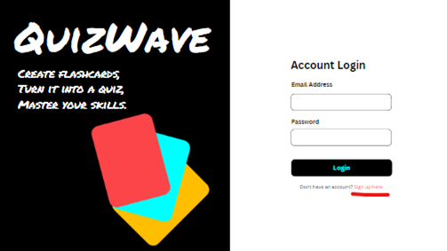
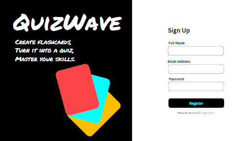
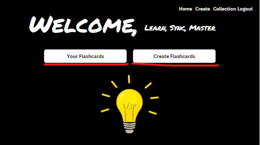
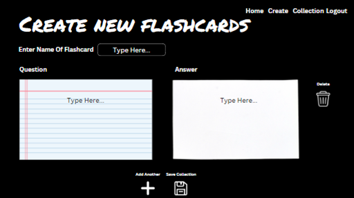
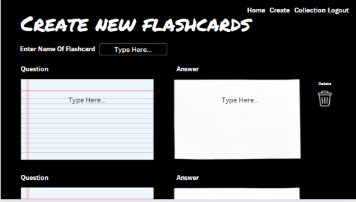
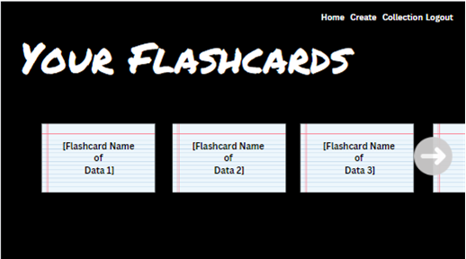
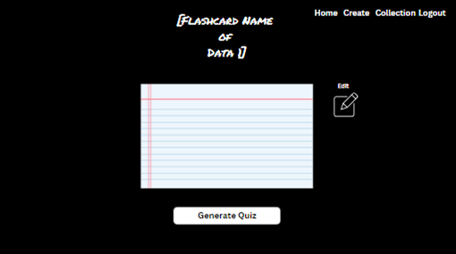
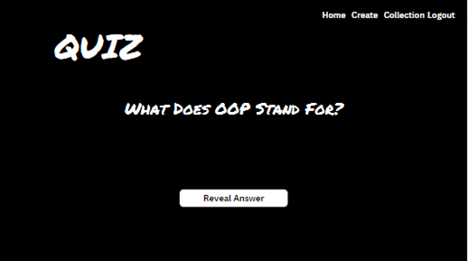
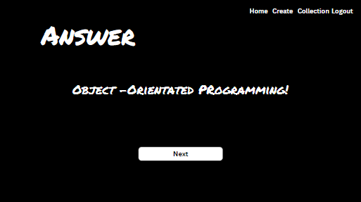

# Group Project 2: Flash Card App

* [Github Repository](https://github.com/JackW2023/FlashCard-APP)
* [Deployed Heroku App](https://calm-island-50179-67f2dfd210f1.herokuapp.com/)

## Project 2 Full Stack Application - Challenge Guideline

Projects play a key role in your journey to becoming a full-stack web developer. As you enter the last phase of the boot camp, you’ll begin to apply for development jobs. If you want to land interviews, your portfolio must feature high-quality deployed examples of your work—and you can use your finished projects for that very purpose.

As your first opportunity to show employers your collaborative skills and coding abilities, this particular project will be a focal point of your portfolio. Employers want to see what you can do, but they also want to see how you work with other developers. The more examples of deployed collaborative work you have in your portfolio, the more likely you are to get an interview and a job. That's why it is important for this project to be added to your portfolio.

## Project Requirements

You and your group will use everything you’ve learned over the past six weeks to create a real-world full-stack application that you’ll be able to showcase to potential employers. The user story and acceptance criteria will depend on the project that you create, but your project must fulfil the following requirements:

* Use Node.js and Express.js to create a RESTful API.
* Use Handlebars.js as the templating engine.
* Use MySQL and the Sequelize ORM for the database.
* Have both GET and POST routes for retrieving and adding new data.
* Be deployed using Heroku (with data).
* Use at least one new library, package, or technology that we haven’t discussed.
* Have a polished UI.
* Be responsive.
* Be interactive (i.e., accept and respond to user input).
* Have a folder structure that meets the MVC paradigm.
* Include authentication (express-session and cookies).
* Protect API keys and sensitive information with environment variables.
* Have a clean repository that meets quality coding standards (file structure, naming conventions, follows best practices for class/id naming conventions, indentation, quality comments, etc.).
* Have a quality README (with unique name, description, technologies used, screenshot, and link to deployed application).
* Finally, you should add your project to the portfolio that you created in Module 2.

## User Story

```
I WANT TO BE SUCCESSFUL.
As a user, I am studying many topics for school but it can be hard to keep track of my notes. I want to create flashcards and quiz myself on what I've learned. I want it accessible and to never lose my flashcards.
I want to be successful.
```

## Purpose

This app is designed to help students or self-learners to practice and test their knowledge through customized mock quizzes with flash cards.


## Important Statement About App Completeness

Due to time constraints, the app is not able to be finished in entirety; only part of the features are realized. The following description outlines the mock-up; the developers are in the process of debugging and the complete product will be made alive soon.

## App Features(Mock-up)

* Create new user account
  * Log in next time
* Create flash cards
  * Edit flash cards
  * Save flash cards
  * Delete flash cards
* Generate quizzes


## Pages Breakdown(Mock-up)




Login page for returning users. For first-timers, click “sign up here”(underlined in red) to create a new account.



Enters the home page. Go to the archive for saved flash cards or make a new deck.



The front and back of a titled flash card. The user can delete, add it to the collection or make another.




Two different layouts of the card collection, either showing both sides or the fronts.



The flash card upon single click. Botton below for quiz generation.




The quiz is started.

## Credits
* UCB Instructor
* TAs
* Members of The Team

## Efforts never fail one, either a hard-working test-taker or a rookie developer team. Good luck with coding as success is awaiting you ahead!
